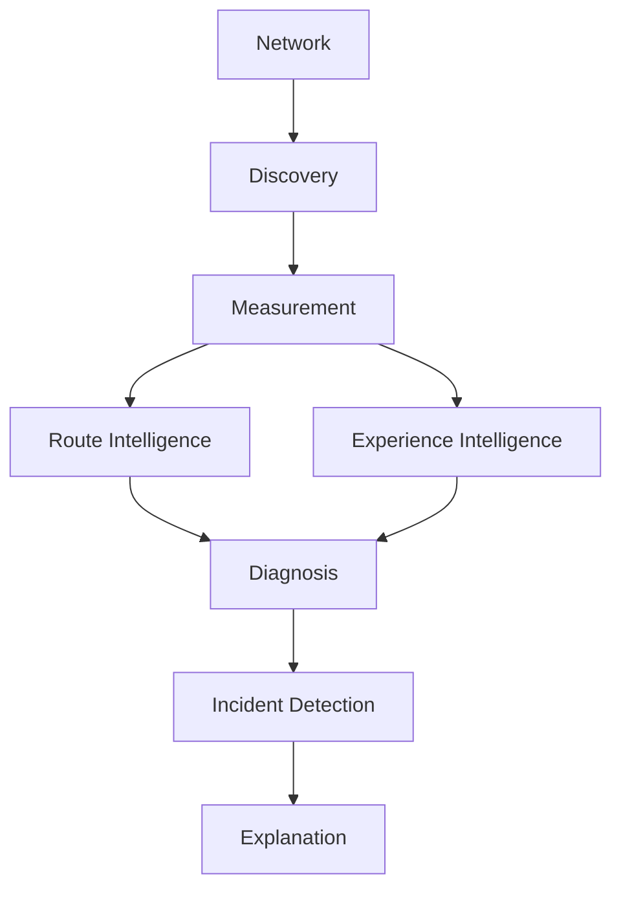

# NetScope — Architecture Overview

**Status:** Proposed (documentation only — nothing in this document is implemented yet)
**Supersedes:** the 11-package structure proposed in `NetScope-Research-Phase1.md` §5
(`core/probes/routing/intelligence/diagnosis/monitoring/explanation/reporting/persistence/infrastructure/ui`)
**Companion documents:** `architecture-decisions.md`, `module-boundaries.md`, `data-flow.md`,
`dependency-strategy.md`, `future-roadmap.md`, and the individual ADRs (`adr-00X-*.md`).
This file is the entry point; the companions go deeper on their respective topics rather
than repeating content here.

This document re-reads `NetScope-Research-Phase1.md` and `docs/architecture/implementation-audit.md`
and turns their findings into explicit engineering decisions.

---

## 1. Why the architecture is changing again

The research phase (Phase 1) proposed 11 top-level packages. The implementation
audit (TASK-002) gave us real evidence about what that structure actually did once
code existed:

- `routing/`, `monitoring/`, `reporting/`, `intelligence/services/` stayed **empty**
  through the entire MVP build — nothing needed them yet, but their presence didn't
  prevent the actual problem the audit found.
- `intelligence/baseline.py` was fully implemented and correct, but sat **orphaned**:
  nothing wired it into `experience_score.py` or `diagnosis/engine.py`, because there
  was no orchestration layer whose job it was to do that wiring. `ui/cli.py` ended up
  doing ad hoc orchestration instead, directly importing five different packages.
- `diagnosis/engine.py` and `core/models.Incident` ended up as two competing models
  for the same concept, because "diagnosis" and "domain model" were split across two
  packages with no single place responsible for the shape of "a diagnosed problem."

The audit's actual structural complaint was never "there are 11 packages instead of
8" — it was "there is no orchestration boundary, and fine-grained splitting of
`intelligence`/`diagnosis`/`explanation`/`monitoring` didn't prevent (and arguably
hid) the real coupling problem." That's new evidence the Phase 1 research didn't
have, because Phase 1 was written before any code existed. Per the task instructions,
this is documented explicitly rather than silently overriding the earlier decision:
**the Phase 1 package layout is superseded, not because it was a bad idea, but
because building against it surfaced a different, more important boundary that it
didn't have.**

The core intent of Phase 1 — small, single-responsibility packages, pure domain logic
separated from I/O, no over-engineering — is **kept**. Only the specific package count
and boundaries change.

---

## 2. Minimal architecture

Five top-level packages, evaluated against the conceptual components the task asked
about (domain, application, adapters, measurement, routing, intelligence, diagnosis,
persistence, services, ui, platform):

```
src/netscope/
├── core/            # domain + application: models, ports, and ALL pure logic
│                     # (baseline, scoring, diagnosis, explanation, route-churn,
│                     #  incident state machine). No I/O. No third-party imports.
│
├── adapters/         # every place NetScope talks to the outside world:
│   ├── probes/       # icmplib / dnspython / httpx / stdlib socket+ssl / traceroute
│   └── discovery.py   # gateway + interface discovery (psutil), platform branching
│                       # lives *inside* this file, not in a separate platform/ tree
│
├── persistence/       # SQLite implementation of the repository ports defined in core
│
├── app/                # composition root + use-case orchestration: wires adapters
│                        # and persistence to core, exposes one API surface for UI
│
└── ui/                 # presentation only (CLI now, Textual TUI later)
```

### Disposition of each conceptual component

| Conceptual component (from the task) | Verdict | Where it lives |
|---|---|---|
| domain | **Necessary** | `core/models.py`, `core/ports.py` |
| application (use-case orchestration) | **Necessary — this was the actual gap found in the audit** | `app/use_cases.py` |
| adapters | **Necessary** | `adapters/` |
| measurement (raw probing) | **Necessary, but not a top-level package** | `adapters/probes/` (I/O) — the domain-level `Measurement`/`DerivedMetric` types live in `core/models.py` |
| routing (route-churn/stability analysis) | **Necessary, but it's pure logic, not I/O** | `core/routing.py` — the *probe* that walks hops (`TracerouteProbe`) is I/O and lives in `adapters/probes/`; the *analysis* of a sequence of `RouteSnapshot`s is pure and lives in `core` |
| intelligence (baseline, scoring) | **Necessary, but it's pure logic** | `core/baseline.py`, `core/scoring.py` — no reason for this to be a package sibling of `diagnosis/` when both are pure functions over the same models |
| diagnosis | **Necessary, but merged with intelligence for the same reason** | `core/diagnosis.py`, `core/explanation.py` |
| persistence | **Necessary** | `persistence/` |
| services (service/target monitoring) | **Not a separate package** — it's a domain model (`Service`) plus a use case that aggregates several probes for one target | `core/models.py` (the `Service` type) + `app/use_cases.py` (the aggregation) |
| ui | **Necessary** | `ui/` |
| platform (OS-specific code) | **Not a separate package tree** — see ADR-002 and §7 below | Branching lives inside the one or two adapter files that actually need it (`adapters/probes/traceroute.py`, `adapters/discovery.py`) |

This is 5 top-level packages versus the original 11 (Phase 1) / 12 (master prompt).
`monitoring/` and `reporting/` are folded into `core/incidents.py` and a thin
`app`-level export function respectively — neither needs to be its own package until
there's more than one file's worth of behavior in it.

### Re-evaluating against the two structures on the table (this task's framing)

This task frames the choice as two options rather than as "Phase 1 vs. audit-informed
revision": the current 7-package repository layout (`core/probes/intelligence/
diagnosis/explanation/persistence/ui`) versus a 12-package fragmentation
(`domain/application/infrastructure/network/measurement/routing/intelligence/
diagnosis/monitoring/persistence/services/ui`). Evaluated directly:

- **The 12-package option is rejected**, for the same reason Phase 1's 11-package
  layout was already found wanting in `adr-001-architecture-style.md`: most of those
  packages (`monitoring`, `services`, half of `routing`) would start empty, and
  fragmentation didn't prevent the audit's actual bugs (orphaned baseline, duplicated
  `Diagnosis`/`Incident` model, untestable orchestration) — it likely would have hidden
  them further by giving each concern its own directory to hide in.
- **The current 7-package option is closer to right-sized**, but the implementation
  audit's central finding was that *none* of those 7 packages was responsible for
  orchestration — `ui/cli.py` did that job by accident. Keeping 7 packages without
  adding an explicit orchestration boundary would repeat the exact bug already found.
- **The decision, unchanged from `adr-001-architecture-style.md`**: 5 packages
  (`core/adapters/persistence/app/ui`), splitting by dependency direction (pure logic
  vs. I/O vs. orchestration vs. presentation) instead of by topic. This is simpler than
  both options on the table (5 vs. 7 vs. 12) while being the only one of the three that
  structurally prevents the audit's orchestration bug, because there is exactly one
  package whose job is orchestration (`app`) instead of zero (both options on the
  table) or many competing ones.

### Extensibility strategy

Because dependency direction is the seam (not topic), extending NetScope in any of
its planned directions touches a predictable, small set of files:

| Extension | Touches | Does not touch |
|---|---|---|
| New probe (e.g. TCP, TLS, traceroute) | One new file in `adapters/probes/`, one line of wiring in `app` | `core`, `persistence`, `ui` |
| New diagnosis hypothesis | `core/diagnosis.py` only | `adapters`, `persistence`, `ui` |
| New storage backend | `persistence/` only, implementing the same `core.ports` | `core`, `adapters`, `ui` |
| New UI (e.g. Textual TUI alongside the CLI) | `ui/` only, calling the same `app` use cases | `core`, `adapters`, `persistence` |
| New derived intelligence (e.g. route-churn scoring) | `core/routing.py` or a new `core` module | `adapters`, `persistence`, `ui` |

This table is the practical form of "Modular / Testable / Extensible" from the
architectural principles list — each row is independently reviewable, matching the
small-task discipline `future-roadmap.md` uses for TASK-005 onward.

---

## 3. Responsibilities

| Component | Responsibility | Can depend on | Must NOT depend on |
|---|---|---|---|
| `core` | Domain models; ports (abstract interfaces adapters/persistence must satisfy); all pure logic — baseline math, scoring, diagnosis rules, explanation text, route-churn detection, incident state transitions | Python stdlib only (`dataclasses`, `enum`, `datetime`, `math`, `typing`) | `adapters`, `persistence`, `app`, `ui`, any third-party library (`icmplib`, `dnspython`, `httpx`, `psutil`, `sqlite3`-as-a-concrete-choice) |
| `adapters` | Translate third-party libraries / OS facilities into `core` models (`RawMeasurement`, `RouteSnapshot`). One file per probe type. Own all platform branching. | `core` (to construct/return its types), third-party libraries, Python stdlib (`socket`, `ssl`, `subprocess`, `platform`) | `persistence`, `app`, `ui` (adapters never orchestrate or persist; they only measure and return) |
| `persistence` | Implement the repository ports defined in `core.ports` using SQLite. Own schema, migrations, and the `sqlite3` dependency entirely. | `core` (for the types it stores/returns), stdlib `sqlite3` | `adapters`, `app`, `ui` |
| `app` | Composition root: constructs concrete adapters/persistence, wires them behind `core.ports`, and exposes use cases (`run_measurement_round()`, `get_experience()`, `diagnose_now()`, `list_recent_incidents()`) as the **only** API the UI is allowed to call | `core`, `adapters`, `persistence` | `ui` (app must not know how its output will be displayed) |
| `ui` | Presentation: argument parsing / TUI widgets / formatting for a terminal. Calls `app` use cases only. | `app`, `core` (models, for typing/display only) | `adapters`, `persistence` directly — any UI that imports `icmplib` or `sqlite3` itself is a boundary violation |

### Test strategy per component

| Component | Test strategy |
|---|---|
| `core` | Pure unit tests, no mocks needed, no network — this is exactly what TASK-003's 51 characterization tests already demonstrate is possible today |
| `adapters` | Unit tests with the underlying library/OS call monkeypatched or dependency-injected (this is TASK-006 from the audit, still pending); a small number of manual/opt-in "real network" integration tests, skipped by default in CI |
| `persistence` | Unit tests against a temp-file or in-memory SQLite database — no real filesystem paths, no network |
| `app` | Unit tests using fake adapters/repositories that satisfy `core.ports` — this is exactly what today's `ui/cli.py` *cannot* be tested with, per the audit's STEP 9 finding |
| `ui` | Thin enough that it mostly doesn't need dedicated tests beyond argument-parsing edge cases; snapshot-style tests only if the Textual TUI grows real interaction logic |

---

## 4. Runtime flow and detailed data flow

### High-level runtime flow

This is the conceptual pipeline NetScope's runtime executes on every measurement
round, independent of package layout:



- **Network**: the physical/OS-level network the machine is attached to — not
  NetScope code, the thing being measured.
- **Discovery**: `adapters/discovery.py` — finds *what* to measure (default gateway,
  active interface, configured DNS servers) before any probe runs.
- **Measurement**: `adapters/probes/*` — runs the actual probes (ICMP/DNS/TCP/TLS/
  HTTP/traceroute) against discovered and user/config-specified targets, producing
  `core.models.RawMeasurement`/`RouteSnapshot`.
- **Route Intelligence**: `core/routing.py` — turns a sequence of `RouteSnapshot`s
  into route-stability signals (churn, hop-level latency/loss trends).
- **Experience Intelligence**: `core/baseline.py` + `core/scoring.py` — turns
  `RawMeasurement`s into baseline-relative derived metrics and an experience score.
  Runs in parallel with Route Intelligence (both consume Measurement, neither
  depends on the other).
- **Diagnosis**: `core/diagnosis.py` — combines Route Intelligence and Experience
  Intelligence outputs (as structured `Evidence`, see §5) into a `Diagnosis`.
- **Incident Detection**: `core/incidents.py` — watches `Diagnosis` results across
  multiple rounds and opens/closes `Incident`s when a classification is sustained.
- **Explanation**: `core/explanation.py` — the final step, converting a `Diagnosis`/
  `Incident` into human-readable text. Nothing downstream of this reasons further —
  `app`/`ui` only display it.

This diagram is intentionally about *conceptual stages*, not package names —
`data-flow.md` maps each stage onto exact modules, function boundaries, and,
critically, how a stage that *couldn't run* (not measured) is represented so it is
never confused with a stage that ran and found things healthy.

### Detailed internal data flow (within `core`)

```
Network / OS
      │
      ▼
  adapters/probes/*        ── icmplib / dnspython / httpx / stdlib socket+ssl / OS traceroute
      │  (translation happens HERE: library-specific result → RawMeasurement)
      ▼
  core.models.RawMeasurement
      │
      ▼
  core.scoring / core.routing   ── DerivedMetric (e.g. combined latency+loss score,
      │                            route-churn signal from a sequence of RouteSnapshots)
      ▼
  core.baseline                 ── Baseline comparison (deviation_sigma against
      │                            UserBaseline, loaded via a persistence port)
      ▼
  core.diagnosis                ── Evidence (structured, see §5) built from
      │                            DerivedMetric + Baseline comparison together
      ▼
  core.diagnosis                ── Diagnosis (classification + confidence + evidence
      │                            + ruled-out hypotheses), consuming Evidence only
      ▼
  core.incidents                ── Incident (a Diagnosis sustained across a time
      │                            window, persisted across multiple rounds)
      ▼
  core.explanation               ── Explanation (human-readable text from a
      │                            Diagnosis/Incident — no new reasoning here)
      ▼
  app.use_cases                  ── orchestrates the above, persists intermediate
      │                            state (measurements, baselines, incidents) via
      │                            persistence ports
      ▼
  ui                              ── displays the Explanation/Diagnosis/Incident;
                                     never touches anything above `app`
```

**Where each transformation happens, explicitly:**

- **Probe → RawMeasurement**: in `adapters/probes/*`. This is the *only* place a
  third-party return type is allowed to exist; it never crosses the adapter boundary.
- **RawMeasurement → DerivedMetric**: in `core/scoring.py` (for experience-style
  metrics) and `core/routing.py` (for route-stability metrics). Pure functions.
- **DerivedMetric → Baseline comparison**: in `core/baseline.py` (already exists,
  algorithm unchanged — this is the wiring the audit found missing, addressed as a
  future task, not in this document).
- **DerivedMetric + Baseline → Evidence**: in `core/diagnosis.py`. This is new: today's
  `diagnosis/engine.py` skips straight from `RawMeasurement` to `Diagnosis` with no
  intermediate `Evidence` type (see §5).
- **Evidence → Diagnosis**: also in `core/diagnosis.py`, but as a separate function
  from evidence-collection, so each can be tested and reasoned about independently
  (this directly fixes the audit's STEP 6 finding that evidence-gathering and
  cause-selection are currently mixed in one function).
- **Diagnosis → Incident**: in `core/incidents.py`. An `Incident` is what you get when
  the *same* diagnosis classification persists across multiple measurement rounds —
  this is where "one bad ping" is distinguished from "an actual problem."
- **Diagnosis/Incident → Explanation**: in `core/explanation.py`, unchanged in spirit
  from today's `explanation/explainer.py`, just relocated.
- **Persistence** happens at the `app` layer, between rounds — `core` never persists
  anything itself, it only returns values for `app` to hand to `persistence`.

---

## 5. Domain model (conceptual — not implemented in this task)

### Measurement
A single probe result. Must eventually carry: `target`, `protocol` (replaces the
current bare `ProbeType`), `timestamp`, `success`, `latency_ms`, `packet_loss_pct`,
structured `error` (see §6, not a bare string as today), and protocol-specific
`metadata` (kept as a typed-enough sub-structure per protocol rather than one
catch-all `dict`, where practical — e.g. DNS's resolver/answers, HTTP's status
code/redirect chain).

### Hop
One point in a traceroute. Must support: hop number (`distance`, matching
`icmplib.Hop`'s own field name — see ADR-003), `ip`, `hostname` (reverse DNS, looked
up separately from the traceroute probe itself), `latency_ms` (from `icmplib.Hop`'s
`avg_rtt`), `timeout`/no-response flag, `asn`, `organization`, `country`, and optional
geographic metadata — the last four coming from a separate lookup adapter, not the
traceroute probe.

### RouteSnapshot
A full route to a target at one point in time — an ordered list of `Hop`. Already
exists today as `core.models.RouteSnapshot` with a `signature()` method; that shape is
kept. `core/routing.py` will consume a *sequence* of `RouteSnapshot`s over time to
detect churn — the model itself doesn't need to change for that.

### Evidence
**Must not be free-form text** (this was an explicit audit finding — today's
`Diagnosis.evidence: list[str]`). Conceptually: `metric` (what was measured, e.g.
"gateway_latency"), `observed_value`, `expected_value` (from baseline, if available),
`deviation` (e.g. sigma, or `None` if no baseline yet), `severity`, `source`
(which `Measurement` or `RouteSnapshot` it came from), and a `confidence` contribution.
A `Diagnosis` is built *from* a list of `Evidence`, not from raw booleans computed
inline, as today.

### Diagnosis
Must contain: `classification` (one of the hypothesis enum in §11, replacing today's
free-text `likely_cause`), `evidence: list[Evidence]`, `confidence`, `ruled_out:
list[Evidence-or-Hypothesis]`, and `timestamp`. This absorbs and replaces both
today's `diagnosis.engine.Diagnosis` *and* the diagnosis-shaped fields currently
duplicated on `core.models.Incident` (see §1 — this is the model-duplication fix the
audit flagged, TASK-004 in its numbering).

### Incident
Must represent: `started_at`, `ended_at` (`None` while active — this part of today's
model is kept as-is), `severity`, the affected `target`/`Service`, `evidence` (the
union of evidence across the incident's lifetime, not just its start), and the
`Diagnosis` that explains it. An `Incident` is *produced from* a sequence of
`Diagnosis`es over time by `core/incidents.py`, not diagnosed directly itself.

### Service
Represents a monitored target generically — **no hardcoded "GitHub"/"Cloudflare"/
"Telegram" in the domain**. Conceptually: a `name` (user- or config-supplied label),
a `host`/`address`, and a set of enabled checks (`icmp`, `dns`, `tcp`, `tls`, `http`,
each optional). "Service intelligence" (is *this specific* service down while others
are fine) is a query over `Measurement`s grouped by `Service`, not a different kind of
probe.

---

## 6. Error model

The audit's STEP 7 found that all three current probes collapse every failure into
`error: Optional[str] = str(exc)`, discarding exception type before it ever reaches
`diagnosis/engine.py` (which doesn't read `.error` at all today).

**Structured error type** (conceptual — not implemented):

```
ProbeErrorType:
    TIMEOUT
    DNS_FAILURE
    CONNECTION_REFUSED
    NETWORK_UNREACHABLE
    PERMISSION_DENIED
    TLS_FAILURE
    HTTP_FAILURE
    PROBE_UNAVAILABLE      # e.g. required library/binary missing, as today's
                            # "icmplib not installed" case already is, just untyped
    PLATFORM_UNSUPPORTED   # e.g. traceroute requested on a platform/privilege
                            # combination that can't run it
    UNKNOWN                # explicit escape hatch — never silently miscategorize
```

**How errors travel, end to end:**

1. Each adapter owns a small, private mapping from the exceptions its specific
   library/OS call can raise to a `ProbeErrorType` (e.g. `adapters/probes/dns.py` maps
   `dns.resolver.NXDOMAIN` → `DNS_FAILURE`, `dns.exception.Timeout` → `TIMEOUT`;
   `adapters/probes/icmp.py` maps `icmplib.exceptions.SocketPermissionError` →
   `PERMISSION_DENIED`). This mapping is the *only* place that needs to know about a
   specific library's exception types.
2. The adapter attaches `(error_type, error_message)` to the `Measurement` it returns
   — never a bare string alone. `error_message` is kept for logs/debugging;
   `error_type` is what `core` is allowed to branch on.
3. `core/diagnosis.py` can then use `error_type` as first-class evidence — e.g.
   `DNS_FAILURE` on the public resolver but a healthy gateway is a *qualitatively
   different* hypothesis (`DNS_ISSUE`) than a `TIMEOUT` on the same target, which today's
   engine cannot express at all (both currently collapse into the same `is_bad() ==
   True`, indistinguishable from a high-latency response).
4. `UNKNOWN` is a deliberate, explicit category — if an adapter catches an exception
   it doesn't recognize, it is required to record `UNKNOWN` with the real exception
   message rather than defaulting to a more specific-looking category it hasn't
   actually verified.

---

## 7. Platform strategy

See ADR-002 for the full reasoning. Summary: **no `platform/windows|linux|macos/`
tree.** Reasoning:

- `icmplib`, `dnspython`, and `httpx` are already cross-platform through the
  libraries themselves — `adapters/probes/icmp.py`, `dns.py`, and `http.py` need zero
  OS branching today, confirmed by the fact that the current MVP versions of these
  three files (audited in TASK-002, unchanged since) already work identically on any
  OS Python supports.
- Only two places currently need OS-specific behavior: traceroute (privilege model
  differs slightly by OS, see ADR-003) and gateway/interface discovery (`psutil`
  itself is cross-platform, but *interpreting* "which interface is the default
  gateway" has minor OS-specific quirks).
- A three-way directory tree for two files' worth of actual divergence is the kind of
  premature fragmentation the master prompt explicitly warned against
  ("Architecture نباید unnecessarily پیچیده باشد"). If a third OS-specific need
  emerges later and the branching inside `adapters/probes/traceroute.py` and
  `adapters/discovery.py` grows unwieldy, *that* is the trigger to extract a
  `platform/` tree — not a decision to make speculatively now.

---

## 8. Probe abstraction

```python
# core/ports.py (conceptual — not implemented)

class Probe(Protocol):
    def run(self, target: str, **kwargs) -> Measurement: ...
```

Concrete adapters implement this: `ICMPEchoProbe` (wraps `icmplib.ping`),
`DNSProbe` (wraps `dns.resolver`), `TCPProbe`/`TLSProbe` (wrap stdlib `socket`/`ssl`
— no third-party library needed, per Phase 1 research §4), `HTTPProbe` (wraps
`httpx`), `TracerouteProbe` (wraps `icmplib.traceroute`, see ADR-003).

`core` depends on `Probe` (the Protocol, defined *in* `core.ports`) but never on any
concrete adapter class, and never imports `icmplib`/`dnspython`/`httpx` itself. `app`
is the only place that imports both `core.ports.Probe` and a concrete
`adapters.probes.*` class together, to wire one to the other. This is what makes
"swap `icmplib` for something else later" or "add a new probe type" changes that
touch `adapters/` and `app`'s wiring only — never `core`.

---

## 9. Traceroute strategy

Full comparison and decision in **ADR-003**. Headline finding, confirmed by directly
inspecting the already-installed `icmplib` package rather than assuming: **`icmplib`
— already a dependency, already LGPL-3.0-cleared, already used for ICMP ping — ships
its own `traceroute()` function**, returning a list of `Hop` objects
(`address`, `avg_rtt`, `packet_loss`, `distance`). This directly confirms (not
contradicts) Phase 1 research §4's plan to base traceroute on `icmplib` rather than
`scapy` (GPL-2.0) or a from-scratch raw-socket implementation. It requires root/
Administrator privileges unconditionally (verified from the library's own
docstring — unlike `ping`, there is no unprivileged fallback mode for traceroute).
ADR-003 documents this as the primary approach, with an OS-`traceroute`/`tracert`
subprocess adapter as an optional fallback for environments where raw ICMP sockets
aren't available (e.g. some sandboxed/managed environments) — selectable by `app`'s
composition root, not a runtime auto-detect inside `core`.

---

## 10. Scoring engine (future direction — not implemented here)

Per the task, the static-threshold scoring in today's `experience_score.py` is **not
rewritten in this task**. Future direction:

```
Raw Metrics → Baseline → Metric Deviation → Metric Scores → Weighted Experience Score
```

- **Baseline source**: `core/baseline.py`'s existing `UserBaseline`/`MetricBaseline`
  (Welford's algorithm, unchanged), loaded at the start of an `app` use-case via a
  `BaselineRepository` port and persisted back after each observation. This is the
  wiring the audit found missing (TASK-008/009 in its numbering) — this document
  specifies *where* that wiring will live (`app/use_cases.py`) without implementing it.
- **Insufficient history**: `MetricBaseline.deviation_sigma()` already returns `0.0`
  below 5 samples (unchanged behavior, characterized by TASK-003's tests). The future
  scoring engine must treat "0.0 because insufficient history" as a distinct case from
  "0.0 because the value is genuinely at the mean" — today's code cannot tell these
  apart, which is itself worth carrying into the eventual scoring rewrite as a known
  requirement rather than an afterthought.
- **Missing measurements**: represented as `Measurement` objects with `success=False`
  and a structured `error` (§6), not as absent entries — this lets scoring/diagnosis
  see *that* a probe was attempted and failed, distinct from *never having tried* (the
  audit's untested-gateway bug came from conflating these two states via `None`).
- **Confidence and scoring**: a metric with very few baseline samples should
  contribute a lower-confidence signal to the weighted score than one with a mature
  baseline — the *mechanism* for this (e.g. weighting by `min(count/N, 1.0)`) is left
  as an implementation decision for the rewrite task, not fixed here, since the task
  instructions say not to finalize arbitrary numeric thresholds without research
  backing them.
- **Different network types**: `UserBaseline` is already keyed per-target
  (`latency: dict[str, MetricBaseline]`), so a mobile-hotspot baseline and a home-fiber
  baseline for two different targets don't interfere — this already works today,
  nothing new needed architecturally, just documented here as confirmed by re-reading
  `core/baseline.py`.

---

## 11. Diagnosis engine (future direction — not implemented here)

Per the task, today's `diagnosis/engine.py` is **not rewritten in this task**. Future
direction: hypothesis-based rather than a fixed three-way `if`/`elif` chain.

```
Hypothesis (enum):
    LOCAL_NETWORK_ISSUE
    ISP_ACCESS_ISSUE
    DNS_ISSUE
    ROUTING_DEGRADATION
    DESTINATION_ISSUE
    SERVICE_ISSUE
    GENERAL_CONNECTIVITY_ISSUE
    INSUFFICIENT_EVIDENCE      # explicit, not a silent fallthrough to "No issue
                                # detected" the way an all-None input is treated today
```

A future `Diagnosis` must be able to answer, using the `Evidence` list it was built
from (§5):

- **What happened?** → `classification` (one `Hypothesis`)
- **Why do we believe it?** → the subset of `Evidence` that supports the winning
  hypothesis
- **What evidence supports it? / contradicts it?** → `Evidence` naturally splits into
  supporting vs. contradicting once it's a structured list rather than two separate
  free-text arrays (`evidence`/`ruled_out`) built by different code paths as today
- **What was not tested?** → this is the direct fix for the audit's headline bug:
  a target with no `Measurement` at all must produce evidence of type "not tested,"
  which is evidence *for* `INSUFFICIENT_EVIDENCE`, not silently absent from
  consideration the way `is_bad(None) == False` treats it today
- **How confident are we?** → derived from the strength/count of supporting evidence
  (e.g. baseline deviation sigma, number of independent corroborating measurements),
  not a hand-picked constant per branch (today's `80.0`/`70.0`/`65.0`/`90.0`)

---

## 12. Persistence

See ADR-005 for the full decision. Summary: **SQLite is kept**, but moved fully
behind repository ports so `core` and `app`'s use cases depend on an interface, not
`sqlite3` directly. Conceptual storage boundaries (no schema/migrations designed
here): `MeasurementRepository`, `RouteRepository` (snapshots + hops), `BaselineRepository`,
`ServiceRepository`, `IncidentRepository` (incidents + the diagnoses/evidence attached
to them). Today's single `measurements` table (audited in TASK-002) is a valid subset
of `MeasurementRepository`'s eventual implementation — nothing about it needs to be
thrown away, only extended.

---

## 13. Service monitoring

A `Service` (§5) is user- or config-defined, never hardcoded. `app/use_cases.py`
exposes something like `check_service(service: Service) -> list[Measurement]`, which
runs whichever of `icmp`/`dns`/`tcp`/`tls`/`http` that `Service` has enabled through
the corresponding `adapters/probes/*`, and hands the resulting `Measurement`s to
`core` for scoring/diagnosis exactly like any other measurement round. "Is the problem
specific to this one service" is answered by comparing that `Service`'s `Diagnosis`
against a simultaneous generic-target `Diagnosis` (e.g. the existing gateway/public-DNS/
public-CDN triangle) — an application-level correlation, not a new kind of probe.

---

## 14. Security & privacy

- **Local-first storage**: kept as an explicit architectural constraint — `persistence`
  defaults to a local SQLite file (unchanged from today's `~/.netscope/netscope.db`
  path), and no other component is permitted to open a network connection to anything
  other than a `Measurement` or `RouteSnapshot`'s declared target.
- **Public IP handling**: not yet implemented anywhere; if added, it must go through
  `adapters/` like any other probe, and the resulting value is a `Measurement` like
  any other — it is not treated as an implicit identifier attached to stored data.
- **DNS data**: DNS answers are stored locally only, as today (verified in TASK-002's
  privacy audit); this document doesn't change that.
- **Network metadata** (interfaces, gateway): read via `adapters/discovery.py`
  (`psutil`), used for measurement targeting only, never transmitted anywhere.
- **Optional telemetry**: explicitly **not implemented**, and any future telemetry
  must be opt-in, off by default, and — per architecture — would live entirely inside
  `app`'s composition root as an optional, separately-injected reporting sink, never
  woven into `core` or `adapters`.
- **Secrets**: none exist in the current or proposed architecture (no API keys/tokens
  needed for `icmplib`/`dnspython`/`httpx`; a future GeoLite2 integration would need a
  local database file and MaxMind account, not a runtime secret NetScope transmits).
- **Logging**: not yet designed; when added, logs must not include full DNS answer
  contents or other target-identifying payloads at default verbosity, to keep local
  log files from becoming a second, less-obvious copy of potentially sensitive
  browsing-adjacent data.
- **NetScope must not require cloud infrastructure for core functionality** — nothing
  in this architecture introduces a required network dependency beyond the
  user's own measurement targets and the optional MaxMind GeoLite2 database download
  (a one-time, user-initiated setup step, not a runtime requirement).

---

## 15. What remains intentionally unimplemented after this task

- TCP/TLS probe adapters (design is specified in §8; code is not written)
- Traceroute adapter (`icmplib.traceroute` wrapper; strategy decided in ADR-003, not built)
- ASN/GeoIP lookup adapter (dependency policy decided in ADR-006; not built)
- `core/routing.py` route-churn detection logic
- `core/incidents.py` incident state machine
- Structured `Evidence`/`Hypothesis`-based rewrite of scoring and diagnosis (§10, §11)
- `core.ports` Protocol definitions and the `app` composition root that wires
  concrete adapters/persistence to them
- Repository implementations for anything beyond the current `measurements` table
- Textual TUI (framework decided in ADR-004, not built)
- Any actual migration of `src/netscope/{probes,intelligence,diagnosis,explanation,
  persistence,ui}` into the new `core/adapters/persistence/app/ui` layout — this
  document is the plan for that migration, not the migration itself

---

## 16. Final architecture review

| Question | Answer |
|---|---|
| Is the architecture simpler than the original proposal? | Yes — 5 top-level packages instead of 11/12, with the empty placeholder packages folded into files inside `core`, justified by concrete evidence from the implementation audit (§1). |
| Can a new probe be added without changing the domain? | Yes — a new adapter implementing `core.ports.Probe` and returning `core.models.Measurement` requires no change to `core`; only `app`'s wiring needs to register it. |
| Can Windows/Linux/macOS implementations differ without leaking platform code into the domain? | Yes — platform branching is confined to `adapters/probes/traceroute.py` and `adapters/discovery.py`; `core` never imports `platform`, `subprocess`, or any OS-specific module. |
| Can the measurement engine use different third-party libraries later? | Yes — swapping `icmplib` for another ICMP library touches only `adapters/probes/icmp.py`; `core.ports.Probe` and `core.models.Measurement` are unaffected. |
| Can the UI be replaced without rewriting the network engine? | Yes — `ui` depends only on `app`'s use cases; a Textual TUI and today's CLI can both exist calling the same `app` functions, per §3's dependency table. |
| Can the diagnosis engine evolve without changing probes? | Yes — `core/diagnosis.py` consumes `Evidence` built from `Measurement`/`RouteSnapshot`/baseline data; adapters never know a `Hypothesis` enum exists. |
| Can SQLite be replaced later? | Yes — `persistence` implements `core.ports` repository interfaces; `core` and `app`'s use cases never import `sqlite3` directly. |
| Can NetScope use open-source implementations without copying their source? | Yes — every adapter wraps a library via its public API (`icmplib.ping`/`traceroute`, `dns.resolver`, `httpx.Client`) exactly as today's MVP already does; no GPL/NPSL source has been or needs to be copied (re-confirmed for traceroute specifically in ADR-003, since it was the one capability still undecided). |
| Can the system remain useful completely offline? | Yes — every capability described here (measurement, baseline, diagnosis, persistence, UI) operates against user-specified or default local/public targets with no required external service, consistent with §14. |

All nine answers are yes; the architecture does not need to be revisited before
proceeding to the next task.

---

## 17. Recommended next task

**TASK-005 — Define `core.ports` and the domain model types from §5, as code, with
unit tests only (no adapters, no persistence, no wiring yet).** This is the smallest
possible slice that turns this document into something the rest of the migration can
build against, and it's pure/testable in isolation exactly like TASK-003's work,
keeping risk low before touching any I/O-adjacent code.
